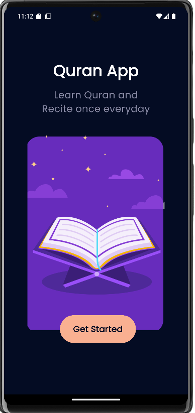
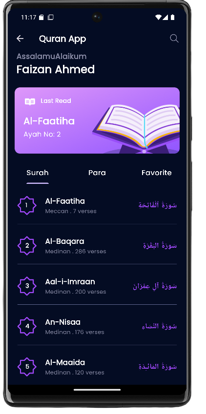
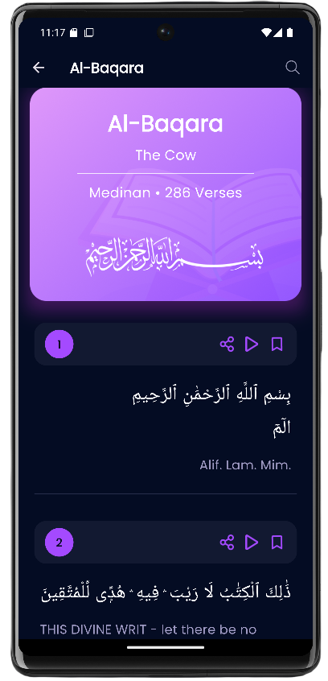
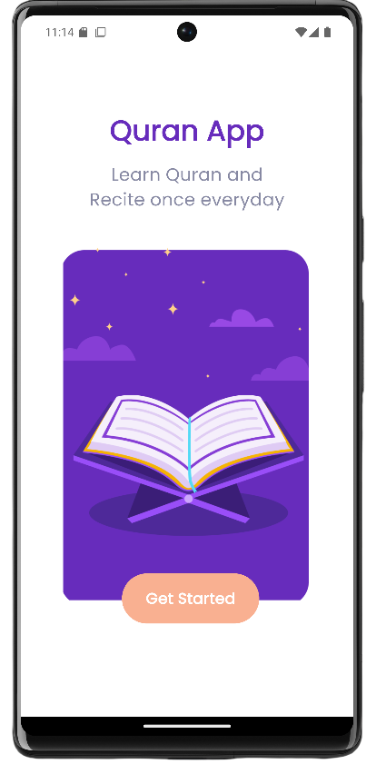
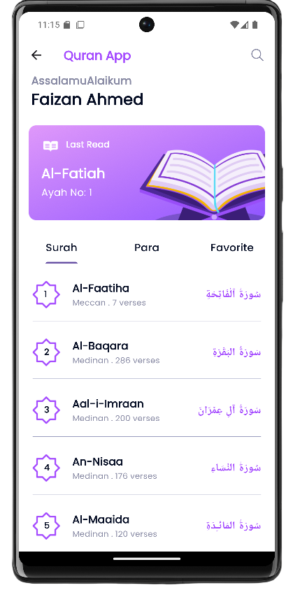
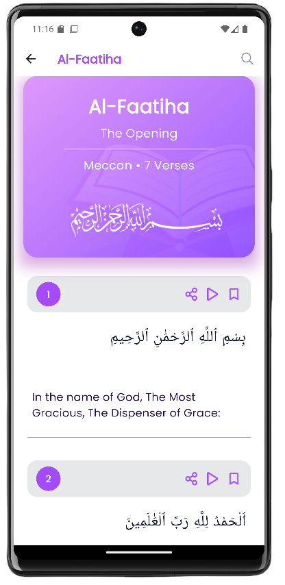

# 🕌 **Bayyinah - Quran Reading App**  

**Bayyinah** is a Flutter-based Quran reading application designed for a seamless and enriched user experience. The app provides users with the ability to read the Quran, listen to audio recitations, save the last read verses, and navigate the Quran by Parah. It ensures a smooth, user-friendly interface for an engaging and spiritual journey.  
🚧 Note: This project is still in progress and under active development. Some features may not be fully implemented yet. 🚧

---


---
## 📖 **Table of Contents**
- [Features](#features)
- [Tech Stack](#tech-stack)
- [Installation](#installation)
- [Project Structure](#project-structure)
- [Screenshots](#screenshots)
- [How It Works](#how-it-works)
- [License](#license)
- [Author](#author)

---

## 🎯 **Features**  
✔️ **Quran Reading:** Users can read the complete Quran with a smooth scrolling experience.  
✔️ **Audio Recitation:** Listen to high-quality Quran recitations by multiple Qaris.  
✔️ **Last Read Bookmarking:** Automatically saves the last read verse for quick access.  
✔️ **Parah-Based Reading:** Users can navigate the Quran by Parah (Juz).  
✔️ **User-Friendly Interface:** Clean and modern UI for a distraction-free reading experience.  
✔️ **Dark & Light Mode:** Choose between light and dark themes for comfortable reading.  

---


## 💻 **Tech Stack**
- **Frontend:** Flutter (Dart)  
- **State Management:** Provider  
- **Quran API:** for Quranic text and translations 


---


## 🛠 **Installation**  

1️⃣ **Clone the Repository**  
```bash
git clone https://github.com/your-github-username/bayyinah.git
```
2️⃣ **Navigate to the Project Directory**  
```bash
cd bayyinah
```
3️⃣ **Install Dependencies**  
```bash
flutter pub get
```
4️⃣ **Run the App**  
```bash
flutter run
```


---


## 📂 **Project Structure**
```
bayyinah/
│── 📂 android/
│── 📂 ios/
│── 📂 linux/
│── 📂 macos/
│── 📂 web/
│── 📂 windows/
│── 📂 asset/
│── 📂 lib/
│   ├── 📂 const/                # Stores constant values like colors, themes, etc.
│   │   ├── colors.dart
│   │
│   ├── 📂 feature/              # Core application features
│   │   ├── 📂 detail/view/      # Quran details UI
│   │   │   ├── home_detail_screen.dart
│   │   ├── 📂 home/view/        # Home screen UI
│   │   │   ├── home_screen.dart
│   │   ├── 📂 splash/           # Splash screen logic & UI
│   │   │   ├── splash_screen.dart
│   │
│   ├── 📂 model/                # Data models for Quran & translations
│   │   ├── quran_model.dart
│   │   ├── quran_translation.dart
│   │
│   ├── 📂 theme/                # App theme & shared preferences
│   │   ├── shared_pref.dart
│   │   ├── theme_modal.dart
│   │
│   ├── 📜 quran.dart             # Main Quran logic file
│   ├── 📜 quran_cache.dart       # Caching mechanism for Quran data
│   ├── 📜 main.dart              # Main entry point of the Flutter app
│
│── 📜 pubspec.yaml               # Flutter dependencies & asset definitions
│── 📜 README.md                   # Project documentation
```


### 📂 **Main Folder Breakdown**
- lib/ → Main application codebase, including features, UI, and logic.  
- theme/ → Defines app-wide styling, colors, and fonts.  
- utils/ → Contains utility functions and helper classes.  
- assets/ → Stores static resources like images, icons, and fonts.    
- main.dart → Entry point of the Flutter application.  
- pubspec.yaml → Defines dependencies, assets, and app configurations.  
- README.md → Project documentation file.  


---


## 📸 **Screenshots**

> ### **Dark Mode**
           


> ### **Light Mode**
           


---


## ⚙️ **How It Works**
### 1️⃣ Quran Reading  
- Users can scroll through and read the **entire Quran** with a smooth interface.  
- **Parah-based navigation** allows easy access to specific sections.  

### 2️⃣ Audio Recitation  
- Users can listen to **high-quality recitations** of the Quran.  
- **Multiple Qaris** available for selection.  

### 3️⃣ Last Read Bookmarking  
- The app **saves** the last read verse for easy resumption.  
- Users can also **manually bookmark** specific verses.  

### 4️⃣ Dark & Light Mode  
- Users can toggle between **light and dark themes** for a better reading experience.  


---


## 📜 **License**
This project is licensed under the **MIT License**.


---


## 🧑 **Author**
**Faizan Ahmed**  
🔗 **LinkedIn:** [Your LinkedIn Profile](https://www.linkedin.com/in/faizan-ahmed-303793255/)  

---

### ⭐ **Support & Follow**
If you liked this repo, please **support it by giving a star ⭐!**  
Also, follow my **GitHub profile** to stay updated about my latest projects:  
🔗 **GitHub:** [Your GitHub Profile](https://github.com/FaizanAhmed44)

---
